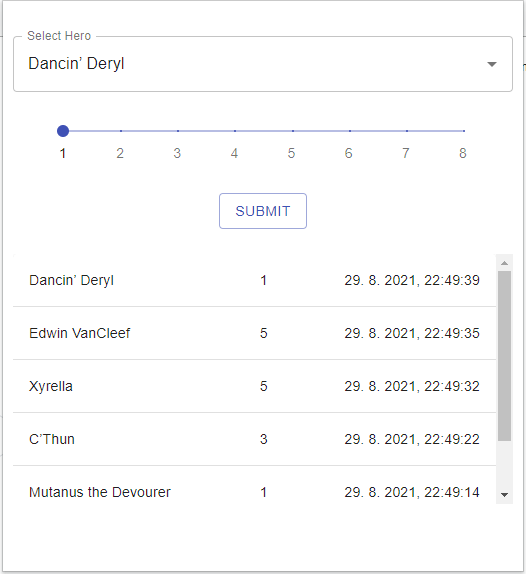

# Hearthstone Battlegrounds tracker

Simple browser plugin which tracks standings in Hearthstone game mode Battlegrounds.

## TODO:

v1.1

- delete / edit a table row
- split heroes in Selectbox by tier, add highlight
- analytics tab ( WR per Hero, ... )

v1.2

- Hearthstone like css

v1.3

- utilize Hearthstone API

